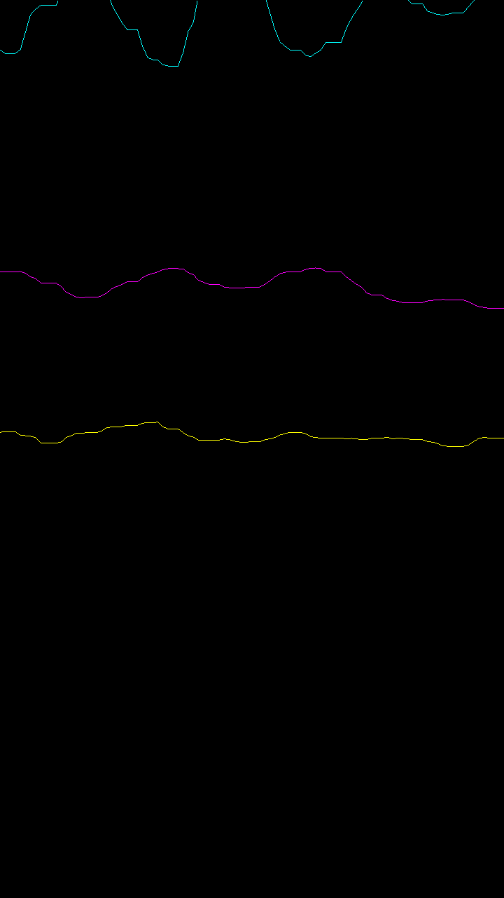

Sensor-Graph (accelerometerwithopengl)
============
Sensor graph is a C++ Android sample that read current accelerometer values and draw them using OpenGL. (https://github.com/googlesamples/android-ndk/tree/master/sensor-graph)

accelerometerwithopengl-melvincabatuan created by Classroom for GitHub

It demonstrate usage of the following Native C++ API:
- [Sensors](http://developer.android.com/ndk/reference/group___sensor.html)
- [Assets](http://developer.android.com/ndk/reference/group___asset.html)

Pre-requisites
--------------
- Android Studio 1.3 with [NDK](https://developer.android.com/ndk/) bundle.

Getting Started
---------------
1. [Download Android Studio](http://developer.android.com/sdk/index.html)
1. Launch Android Studio.
1. Open `android-ndk/sensor-graph` sample.
1. Open *File/Project Structure...*
  1. Click *Download* or *Select NDK location*.
1. Click *Tools/Android/Sync Project with Gradle Files*.
1. Click *Run/Run 'app'*.

Support
-------
If you've found an error in these samples, please [file an issue](https://github.com/googlesamples/android-ndk/issues/new).

Patches are encouraged, and may be submitted by [forking this project](https://github.com/googlesamples/android-ndk/fork) and
submitting a pull request through GitHub. Please see [CONTRIBUTING.md](../CONTRIBUTING.md) for more details.

- [Stack Overflow](http://stackoverflow.com/questions/tagged/android-ndk)
- [Google+ Community](https://plus.google.com/communities/105153134372062985968)
- [Android Tools Feedbacks](http://tools.android.com/feedback)

License
-------
Copyright 2015 Google, Inc.

Licensed to the Apache Software Foundation (ASF) under one or more contributor
license agreements.  See the NOTICE file distributed with this work for
additional information regarding copyright ownership.  The ASF licenses this
file to you under the Apache License, Version 2.0 (the "License"); you may not
use this file except in compliance with the License.  You may obtain a copy of
the License at

  http://www.apache.org/licenses/LICENSE-2.0

Unless required by applicable law or agreed to in writing, software
distributed under the License is distributed on an "AS IS" BASIS, WITHOUT
WARRANTIES OR CONDITIONS OF ANY KIND, either express or implied.  See the
License for the specific language governing permissions and limitations under
the License.


# This Assignment 


## Accept

To accept the assignment, click the following URL:

https://classroom.github.com/assignment-invitations/65bc338c2be439d1a2ed986b97023b1a

## Sample Solution:

https://github.com/DeLaSalleUniversity-Manila/accelerometerwithopengl-melvincabatuan

## Submission Procedure with Git: 

```shell
$ cd /path/to/your/android/app/
$ git init
$ git add –all
$ git commit -m "your message, e.x. Assignment 1 submission"
$ git remote add origin <Assignment link copied from assignment github, e.x. https://github.com/DeLaSalleUniversity-Manila/secondactivityassignment-melvincabatuan.git>
$ git push -u origin master
<then Enter Username and Password>
```

## Screenshots:




"*When you don't create things, you become defined by your tastes rather than ability. your tastes only narrow & exclude people. so create.*" - Why The Lucky Stiff
